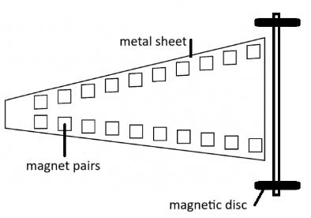
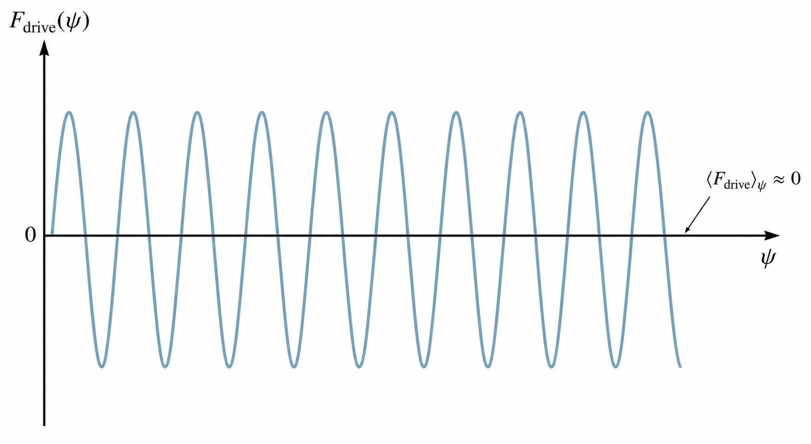

# CUPT/IYPT 2026 第 8 题「磁力加速器」详细理论笔记

> **题面原文：** Fix magnets in pairs onto a metal sheet as shown. If you attach two magnetic discs onto an axle this "vehicle" will accelerate over the rows of magnets under certain conditions. Investigate the phenomenon.
>
> **中文口径：** 按图示把磁铁成对固定在金属板上。把两个盘状磁体装到一根轴上，这个“车辆”会在特定条件下沿一行行磁体加速。研究这一现象。

## 0. 写作边界和证据标签

本笔记只解决第 8 题本身：**成对固定在金属板上的轨道磁体 + 两个盘状磁体同轴组成的车辆 + 沿磁体行加速的条件**。所有文献都只能作为局部物理模块使用，不能把本题改写成高斯步枪、磁齿轮、线性电机或涡流刹车题。

本文使用四类标签：

| 标签 | 含义 | 可用强度 |
|---|---|---|
| **【题面/图示】** | 来自题面文字和官方图像的装置边界 | 作为几何与问题定义的最高约束 |
| **【文献支持】** | 直接来自 `文献/` 中 PDF 的结论、模型或实验方法 | 只在对应文献适用条件内使用 |
| **【本文推导】** | 由标准电磁学、能量守恒和刚体滚动约束推出 | 必须由本题实验测量或仿真校准 |
| **【实验待定】** | 需要实测的材料、几何、摩擦、磁场或损耗参数 | 不能当作已知事实 |

**本文不做的事：**

- 不把轨道磁体改成圆柱磁体。题图中轨道磁体按方块/近似立方体磁体处理。
- 不把车辆改成“3D 打印车轮上安装磁体”。题面明确是两个 magnetic discs 装到轴上。
- 不把高斯步枪中的钢球碰撞链当成本题主模型。
- 不把 Vokoun 的共轴圆柱磁体解析公式直接套到“方块轨道磁体 - 盘状磁轮 - V 形/楔形排列”的完整装置。
- 不把涡流制动文献中的解析公式当作本题末速度公式。它只能提供低速线性阻尼的建模口径。

## 1. 题目图像对应的物理系统

### 1.1 不能变的装置事实

| 图中对象 | 本题物理对象 | 本文处理方式 |
|---|---|---|
| `metal sheet` | 固定轨道磁体的金属板 | 同时可能带来涡流阻尼和磁镜像效应，材料必须实验区分 |
| `magnets in pairs` | 成对固定在金属板上的轨道磁体 | 按方块/近似立方体磁体建模，成对排列构成左右两列磁轨 |
| `two magnetic discs` | 两个盘状磁体 | 两个盘状磁体本身就是车辆的磁轮 |
| `axle` | 连接两只盘状磁体的刚性轴 | 约束左右磁轮同角速度转动 |
| `rows of magnets` | 车辆经过的成对磁体行 | 主变量是沿轨道方向周期、横向间距、极性和入口/出口边界 |

【题面/图示】题面只保证“成对磁体、金属板、两个盘状磁体和轴”。图中可见轨道不是抽象无限直线，而是有限长度的磁体行；车辆加速发生在“certain conditions”下，不是任意排列都加速。

【实验待定】金属板到底是铝、铜、铁/钢或其他材料，题面没有给出；磁体牌号、尺寸、极性、盘磁体是否带保护圈、车轮实际接触路径也都必须实测。

### 1.2 建模坐标和变量

建立坐标：

- $x$：车辆前进方向。
- $y$：左右两列磁体之间的横向方向。
- $z$：垂直于金属板或局部轨道面的方向。
- $\theta$：盘状磁体绕轴转过的角度。
- $\theta=0$ 的零点由盘磁体磁矩方向相对轨道磁场定义，实验中用盘面标记确定。

几何和材料参数：

| 类别 | 符号 | 含义 | 来源 |
|---|---|---|---|
| 轨道磁体尺寸 | $a_x,a_y,a_z$ | 方块/近似立方体磁体三向尺寸 | 实测 |
| 轨道磁体磁化 | $\mathbf M_{i,\alpha}$ | 第 $i$ 对第 $\alpha=L,R$ 块固定磁体的有效磁化方向和强度 | 极性检测 + 磁场扫描 |
| 轨道周期 | $d_m$ | 相邻磁体对沿 $x$ 的间距 | 实测 |
| 横向间距 | $\Delta y_i,\Delta y_t(x),\Delta_w$ | 第 $i$ 对轨道磁体横向间距、连续化轨道间距、左右磁轮中心距 | 实测 |
| 盘状磁体尺寸 | $r_d,t_d$ | 盘半径和厚度 | 实测 |
| 盘状磁体磁矩 | $m_w$ | 单个盘磁体等效磁矩大小 | 标定 |
| 车轮半径 | $R_w$ | 实际滚动半径 | 裸盘时约等于 $r_d$，有保护圈时重新测 |
| 车辆质量和惯量 | $m,I$ | 总质量、绕轴转动惯量 | 称量 + 几何计算 |
| 金属板 | $\sigma,h,\mu_r$ | 电导率、厚度、相对磁导率 | 材料实测/数据表 |
| 接触 | $\mu_s,\mu_k,c_r$ | 静摩擦、动摩擦、滚动阻力系数 | 倾角法/拖曳实验 |

【本文推导】下面所有运动方程都只在这些变量定义后成立。如果没有测量 $\Delta y_i$ 或 $\Delta y_t(x)$、极性排列和 $R_w$，只能得到定性判断，不能给出可靠预测。

【实验待定】本文不预设盘状磁体一定接触金属板、轨道磁体上表面或额外导轨。只要车辆表现为滚动，就必须用侧视图和盘面标记确认实际接触路径；若存在跳动、悬浮间隙或间歇接触，无滑滚动模型只能作为近似。

### 1.3 题图 V 形轨道的参数化几何

【题面/图示】题图中的轨道磁体成对固定在金属板上。本文把每一对轨道磁体视为同一个 $x$ 位置上的左右两块方块/近似立方体磁体；相邻磁体对沿 $x$ 方向等间距排列，左右两列沿 $y$ 方向逐对等距错位，因此整体呈 V 形/楔形双排。

【本文推导】设共有 $N_p$ 对轨道磁体，第 $i$ 对编号为

$$
i=0,1,\ldots,N_p-1.
$$

【本文推导】相邻磁体对沿前进方向的间距为 $d_m$，则

$$
x_i=x_0+i d_m.
$$

【本文推导】第 $i$ 对左右磁体的横向间距写成等差形式：

$$
\Delta y_i=\Delta y_0-i\delta_y.
$$

【本文推导】统一约定 V 形最宽处为入口处：$\Delta y_0$ 是入口处第一对磁体的横向间距（最大间距），$\delta_y>0$ 是相邻磁体对之间横向间距的收窄量。沿 $+x$ 前进方向，左右两列逐渐向中心线收拢。

【实验待定】$\Delta y_0$ 和 $\delta_y$ 必须由题图标定、俯视照片或实物测量确定，不能由理论预设。若实物不是严格等差 V 形，应把 $\Delta y_i$ 保留为逐对实测序列。

【本文推导】若轨道中心线取 $y=0$，第 $i$ 对左右轨道磁体中心位置为

$$
\mathbf r_{i,L}=\left(x_i,-\frac{\Delta y_i}{2},z_t\right),\qquad
\mathbf r_{i,R}=\left(x_i,+\frac{\Delta y_i}{2},z_t\right).
$$

【本文推导】这里 $z_t$ 是轨道磁体中心相对金属板坐标系的高度。若磁体直接贴在金属板上，$z_t$ 由磁体厚度和坐标原点选取决定。

【本文推导】“$y$ 方向等距错位”对应

$$
\Delta y_{i+1}-\Delta y_i=-\delta_y.
$$

【本文推导】因此两列磁体中心分别满足

$$
y_{i+1,R}-y_{i,R}=-\frac{\delta_y}{2},\qquad
y_{i+1,L}-y_{i,L}=+\frac{\delta_y}{2}.
$$

【本文推导】平行双排是退化情形 $\delta_y=0$，只能作为对照组；题图主构型应保留 $\delta_y\ne0$ 的 V 形/楔形几何。

## 2. 本地文献能支持什么

### 2.1 文献使用总表

| 文件 | 文献主题 | 可用于本题的内容 | 不能越界使用 |
|---|---|---|---|
| `01_Rabchuk_2003_Gauss_Rifle_and_Magnetic_Energy.pdf` | 高斯步枪的磁势能和速度测量 | 磁势能可以通过力-位移积分估计；能量守恒是核心 | 不能把钢球碰撞链当成本题车辆 |
| `02_Kagan_2004_Energy_and_Momentum_in_Gauss_Accelerator.pdf` | 高斯加速器的能量和动量 | 入射/出射状态不等价时，磁势能下降转成动能；损耗不可忽略 | 不能忽略外力和摩擦后声称动量在子系统内守恒 |
| `03_Chemin_2017_Magnetic_Cannon_AJP.pdf` | 磁炮的力测量、能量转换和碰撞传递 | 用 Hall 探头/力测量得到磁能；感应钢球模型可出现 $d^{-7}$ 标度；近场需实测 | 不能把 $d^{-7}$ 用作永磁-永磁主标度 |
| `04_Vokoun_2009_Magnetostatic_Interactions_Cylindrical_Magnets.pdf` | 圆柱永磁体之间的解析力 | 盘状磁体近场标定的基准；远场永磁偶极相互作用可出现 $d^{-4}$ 力标度 | 不能直接计算方块轨道磁体和完整 V 形轨道 |
| `05_Hartung_2021_Dynamics_Magnetic_Gear.pdf` | 磁齿轮锁相、失锁和摩擦 | 相位锁定、滑移、混沌响应、摩擦项建模 | 不能把两个球形磁偶极齿轮几何照搬到本题 |
| `06_Nevaranta_2017_Cogging_Forces_PMLM.pdf` | 不连续永磁轨道的齿槽力 | 离散磁轨边缘会产生位置相关扰动力；FEM 和实验可互相验证 | 不能把线性电机电枢和绕组作为本题装置 |
| `07_Fujii_1995_Permanent_Magnet_Rotating_Magnetic_Wheel.pdf` | 旋转永磁磁轮与导体板 | 旋转磁场耦合导体板会产生涡流、升力、制动力矩和可利用推力 | 不能把主动旋转磁轮当成本题无源滚动车辆 |
| `08_Redinz_2018_Magnetic_Brakes.pdf` | 旋转/平动导体中的涡流制动解析 | 低速非磁导体中涡流制动力与速度近似成正比 | 不能用于高速度、强感应、复杂 3D 方块磁轨的闭式末速度 |

### 2.2 文献事实提炼

**高斯步枪文献的共同点。**
【文献支持】Rabchuk、Kagan、Chemin 都把磁加速问题写成能量问题：初态和末态的磁势能差可以转化为动能，但实际系统有碰撞、摩擦、涡流、形变等损耗。Kagan 用力-距离曲线估计磁势能；Chemin 用磁场和力测量建立可测参数模型，并强调近场和材料磁化会改变标度。

**对本题的启示。**
【本文推导】本题没有钢球碰撞链，因此不能照抄高斯步枪的碰撞传能机制；但能量闭合口径保留：

$$
\Delta K+\Delta E_{\text{loss}}=-\Delta U_{\text{mag}}.
$$

这条式子是本题最重要的反编造约束。若某段文字说车辆“持续加速”，必须同时说明磁势能从哪里下降、损耗如何补偿、为什么不是严格周期无净做功。

**圆柱磁体文献的适用边界。**
【文献支持】Vokoun 在“均匀磁化、圆柱轴线平行、圆柱尺寸明确”的条件下给出圆柱永磁体相互作用力，并说明远距离可回到偶极近似，近距离必须考虑形状效应。

【本文推导】本题车轮是盘状磁体，Vokoun 可以用于“盘磁体对盘磁体”或“盘磁体近场校准”的参考；轨道磁体却是方块/近似立方体，且存在横向错位、V 形/楔形排列和滚动相位，所以主模型必须先构造或测量 $\mathbf B_{\text{track}}(x,y,z)$。

**磁齿轮文献的适用边界。**
【文献支持】Hartung 研究两个旋转磁偶极的耦合，观察到 phase-locked 状态、slip-through 状态、周期倍化和混沌响应；模型中需要加入阻尼和干摩擦项。

【本文推导】若本题盘状磁轮为径向磁化，则会出现“转角 $\theta$ 与轨道周期相位”的锁相问题。因此可借用相位锁定/失锁语言，但不能借用 Hartung 的具体轴角条件。若盘状磁轮为轴向磁化，则没有这一路径的 $\theta$ 锁相项。

**不连续磁轨文献的适用边界。**
【文献支持】Nevaranta 说明不连续永磁轨道的边缘处，由于平衡力缺失，位置相关的 cogging force 会显著增强；实验估计和 FEM 能互相验证。

【本文推导】本题固定磁体成对离散排列，车辆通过每个磁体对时会经历周期性势阱和势垒；入口、出口和局部错位都可能决定能否启动或卡住。

**涡流/磁轮文献的适用边界。**
【文献支持】Fujii 说明旋转永磁体靠近导体板时，导体板中的涡流可产生升力、制动力矩和推力；Redinz 在低速、非磁导体、外磁场主导的条件下得到涡流制动力/力矩，并指出力与速度成正比的线性阻尼近似。

【本文推导】本题车辆不是外部电机主动驱动的磁轮；金属板的主要作用应先作为支撑和材料效应处理。若金属板为铝/铜，低速段可把涡流写成 $F_{\text{eddy}}\approx\gamma_{\text{eddy}}v$；若是铁/钢，则磁镜像和吸附会更重要。

## 3. 需要解释的现象

题目中的 “accelerate under certain conditions” 至少包含四个问题：

1. 为什么有些排列能启动，有些不能？
2. 为什么车辆可能在几对磁体上方越滚越快？
3. 为什么速度不会无限增加？
4. 为什么会出现卡住、打滑、走走停停或反向拉回？

对应观测量：

| 观测量 | 物理含义 | 最低实验手段 |
|---|---|---|
| $x(t),v(t),a(t)$ | 是否真的加速、加速度如何变化 | 高速视频/光电门 |
| $\theta(t),\omega(t)$ | 盘磁体是否无滑滚动；径向磁化时是否锁相 | 盘面标记 + 视频追踪 |
| $v-\omega R_w$ | 打滑程度 | 同步追踪 $x$ 和 $\theta$ |
| $B_x,B_y,B_z$ | 轨道磁场输入 | Hall 探头扫描 |
| $F_x,F_z,\tau_\theta$ | 切向驱动、吸附、力矩 | 拉力计/扭矩法/FEM |
| $U(x,\theta)$ | 势能景观 | 磁场积分或力积分 |
| 材料替换结果 | 涡流/镜像/摩擦分离 | 铝、铜、铁/钢、绝缘板对照 |

【本文推导】若只拍到“车动了”，还不能说明机理。必须同时确认：

$$
a(t)>0,\qquad \omega R_w\approx v,\qquad \Delta K\le -\Delta U_{\text{mag}}.
$$

第一式说明加速；第二式说明是滚动而非滑动；第三式排除“无能量来源的持续加速”。

## 4. 主模型：轨道磁场到磁势能

### 4.1 为什么主模型从磁场开始

【题面/图示】轨道磁体是固定在金属板上的成对磁体，车辆由两个盘状磁体组成。轨道磁体和车辆磁体形状不同，且左右两侧同时作用。

【本文推导】最稳妥的主模型不是先猜某个力标度，而是先写总磁场：

$$
\mathbf B_{\text{track}}(\mathbf r)
=\sum_{i=0}^{N_p-1}
\left[
\mathbf B_{i,L}(\mathbf r-\mathbf r_{i,L})
+\mathbf B_{i,R}(\mathbf r-\mathbf r_{i,R})
\right]
+\mathbf B_{\text{plate}}(\mathbf r).
$$

【本文推导】其中 $\mathbf r=(x,y,z)$ 是场点，$\mathbf B_{i,L}$ 和 $\mathbf B_{i,R}$ 分别是第 $i$ 对左右固定轨道磁体的场，$\mathbf r_{i,L},\mathbf r_{i,R}$ 由 §1.3 的 V 形几何给出，$\mathbf B_{\text{plate}}$ 是金属板材料引起的静态磁镜像或磁场畸变。

【本文推导】对方块轨道磁体采用两层精度策略，两层对应不同的计算路径，核心差别是磁体能否退化为点偶极子。

**远场（g ≫ a_t）——偶极近似。** 当车轮中心到轨道磁体表面的距离远大于磁体特征尺寸 a_t 时，每块轨道磁体的场可以用一个点磁偶极子代替。计算步骤：

1. 将第 $i$ 对第 $\alpha$ 块轨道磁体的磁化矢量 $\mathbf M_{i,\alpha}$ 换算为等效磁偶极矩，其中 $\alpha=L,R$：

$$
\mathbf m_{i,\alpha}=\mathbf M_{i,\alpha}V_t,\qquad
V_t=a_xa_ya_z.
$$

2. 定义场点到该轨道磁体中心的相对位置：

$$
\mathbf R_{i,\alpha}=\mathbf r-\mathbf r_{i,\alpha},\qquad
R_{i,\alpha}=\lvert\mathbf R_{i,\alpha}\rvert.
$$

3. 远场偶极近似下，单块轨道磁体产生的磁感应强度为

$$
\mathbf B_{i,\alpha}(\mathbf r)
=\frac{\mu_0}{4\pi}
\left[
\frac{3\mathbf R_{i,\alpha}
\left(\mathbf m_{i,\alpha}\cdot\mathbf R_{i,\alpha}\right)}
{R_{i,\alpha}^5}
-\frac{\mathbf m_{i,\alpha}}{R_{i,\alpha}^3}
\right].
$$

4. 所有成对轨道磁体线性叠加，再加入金属板修正，得到 $\mathbf B_{\text{track}}(\mathbf r)$。若需要显式写出左右极性，可令 $\mathbf m_{i,\alpha}=s_{i,\alpha}m_t\hat{\mathbf e}_{i,\alpha}$，其中 $s_{i,\alpha}=\pm1$ 由极性检测确定。

【本文推导】偶极近似的优势是完全解析、可快速扫描参数窗口（如径向磁化分支的 $\Pi_5$ 相位匹配、轴向磁化分支的 $B_y$ 梯度、$d_m$ 间距等）。缺点是 $R_{i,\alpha}\sim a_t$ 时，方块磁体近场的高阶多极项不可忽略，偶极场形偏离真实场形。

**近场/接触（g ≲ a_t）——有限尺寸模型。** 当车轮接近或接触轨道磁体时，必须计入磁体的实际几何形状。三条互补路径，可根据实验条件和计算资源选用：

路径一：磁荷面密度积分（等效磁荷法/Coulombian 法）。基于均匀磁化假设 ∇·M = 0，体磁荷为零，场源退化为表面磁荷 σ_m = M·n̂（n̂ 为表面外法向）。对方块磁体，只有磁化方向的两个端面有净磁荷（侧面 n̂ ⟂ M，σ_m = 0），每面对场点的贡献为矩形面积分：
- B_face(r) = (μ₀/4π) × ∫_S σ_m · (r − r')/|r − r'|³ dS'
- 矩形面积分有含 arctan 和 log 函数的解析表达式，精度与 FEM 接近但无需网格划分，适合参数扫描。

路径二：有限元仿真（FEM）。在 COMSOL、ANSYS 或 FEMM 等软件中建立完整 3D 几何（方块轨道磁体、盘状磁轮、空气域），输入材料剩磁 B_r 和相对磁导率 μ_r，近场区加密网格，直接求解静磁方程 ∇ × H = 0、∇·B = 0。精度最高但计算成本大（单配置需数十分钟到数小时），适合对少数关键配置做精确定量，或验证路径一/三的结果。

路径三：实测标定 + Vokoun 形状因子校准。以 Hall 探头扫描或拉力计实测的 B_track 或 F_x 为基准，定义形状修正因子 C_shape(d, Δy, θ; 几何参数)，将解析基准（偶极近似或 Vokoun 圆柱公式）映射到实测值。详细校准形式见附录 A。此路径适合在校准后的参数范围内快速插值，无需每次跑 FEM。

两层之间的过渡区（g ~ a_t）不能简单在偶极和有限尺寸之间硬切换，需要用实测数据或 FEM 仿真做插值衔接。

【实验待定】方块磁体的近场磁场分布必须实测标定，不能直接从偶极公式外推。磁体牌号、镀层厚度、边缘倒角、实际磁化均匀度和方块-盘状磁体之间的退磁耦合都会显著影响近场。

### 4.2 两个盘状磁轮的磁矩

【文献支持】Vokoun 给出的圆柱永磁体公式以“均匀磁化、磁化方向固定、圆柱轴线明确”为前提；Hartung 的磁齿轮模型把永磁体作为磁偶极并跟踪偶极方向角；Chemin、Kagan 和 Rabchuk 都把磁相互作用写成可测磁势能与机械能之间的转换。上述文献支持本题使用“等效磁矩 + 轨道磁场 + 能量账”的框架，但没有直接给出本题“方块轨道磁体 + 两个盘状磁轮”的完整解。

【本文推导】把每个盘状磁体在外部轨道场中先近似为一个等效磁偶极，磁矩大小为标定量 $m_w$。设左右盘磁体中心为

$$
\mathbf r_L=(x,y_L(x),z_L),\qquad
\mathbf r_R=(x,y_R(x),z_R).
$$

同轴约束给出共同转角：

$$
\theta_L=\theta_R=\theta.
$$

盘磁体的磁矩在盘体自身坐标系中固定，但在实验室坐标系中的方向取决于磁化方向和滚动角。若左右盘磁体磁矩大小相同，可写成

$$
\mathbf m_L(\theta)=s_Lm_w\mathbf e_m(\theta),\qquad
\mathbf m_R(\theta)=s_Rm_w\mathbf e_m(\theta),
$$

其中 $s_L,s_R=\pm1$ 表示左右盘磁体安装极性是否同向；$\mathbf e_m(\theta)$ 是磁矩方向单位矢量。

【实验待定】$s_L$、$s_R$ 以及盘磁体是径向磁化还是轴向磁化，必须用指南针、Hall 探头或厂家规格确认，不能由理论预设。若左右盘磁体反向安装，力和力矩相位会改变。

### 4.3 总磁势能

【本文推导】在给定位置和角度下，两个盘磁轮的磁势能统一写成

$$
U(x,\theta)
=-\mathbf m_L(\theta)\cdot\mathbf B_{\text{track}}(\mathbf r_L)
-\mathbf m_R(\theta)\cdot\mathbf B_{\text{track}}(\mathbf r_R)
+U_{\text{plate}}(x,\theta)
+U_{\text{mech}}(x,\theta).
$$

其中：

- $U_{\text{plate}}$：金属板的静态磁镜像修正。对非铁磁铝/铜可先忽略静态项；对铁/钢不能忽略。
- $U_{\text{mech}}$：重力高度变化、轴/支架约束、可能的弹性接触能。若轨道高度近似不变，可先设为常数。

切向力和磁力矩来自同一个势能：

$$
F_x=-\left.\frac{\partial U}{\partial x}\right|_{\theta},
\qquad
\tau_\theta=-\left.\frac{\partial U}{\partial\theta}\right|_{x}.
$$

【本文推导】这个写法的好处是避免重复计算。磁力做功和磁力矩做功都来自 $dU$：

$$
dU=\left.\frac{\partial U}{\partial x}\right|_{\theta}dx
+\left.\frac{\partial U}{\partial\theta}\right|_{x}d\theta.
$$

如果再把 $F_xdx$ 和 $\tau_\theta d\theta$ 当作两个独立能量来源相加，就会把同一份磁势能算两遍。

### 4.4 横向偏移与横向间距修正

【文献支持】Vokoun 对圆柱永磁体之间的相互作用给出了包含横向错位的处理，并把力写成磁能梯度。它能支持一个基本事实：两个盘状永磁体的相对横向位移会改变吸引力和有效势能。但该文献只适用于圆柱磁体的特定几何，不能直接替代本题“方块轨道磁体 + 盘状磁轮 + V 形/楔形轨道”的完整解。

【文献支持】Nevaranta 关于不连续永磁轨道的实验和 FEM 研究说明，磁轨边缘处由于平衡力缺失，会产生位置相关的扰动力和更强的 cogging force。本题的有限长度轨道、入口/出口边界和横向间距变化也会造成类似的“左右贡献不再完全抵消”的位置相关偏置，但具体大小必须由本题几何测量。

【文献支持】Chemin 用磁场测量和力测量建立磁能模型，说明磁势能可以由实测力曲线积分或由磁场模型重建。因此横向偏移不能只靠俯视图目测判断，必须扫描 $\mathbf B_{\text{track}}(x,y,z)$ 或测量牵引力随横向位置的变化。

【本文推导】设车辆中心线相对轨道中线的横向偏移为 $y_c(x)$，左右盘磁轮中心的横向位置写成

$$
y_L(x)=y_c(x)-\frac{\Delta_w}{2},\qquad
y_R(x)=y_c(x)+\frac{\Delta_w}{2},
$$

【本文推导】其中 $\Delta_w$ 是左右盘磁轮中心距。若轨道左右两列固定磁体的横向间距为 $\Delta y_t(x)$，可把轨道列中心近似写成

$$
y_{t,L}(x)=-\frac{\Delta y_t(x)}{2},\qquad
y_{t,R}(x)=+\frac{\Delta y_t(x)}{2}.
$$

【本文推导】于是左右轮相对对应轨道列的横向错位为

$$
\eta_L(x)=y_L(x)-y_{t,L}(x),\qquad
\eta_R(x)=y_R(x)-y_{t,R}(x).
$$

【本文推导】这些量会同时改变磁场幅值、相位和左右贡献是否抵消。

【本文推导】把横向偏移显式写入总势能，可得

$$
U(x,\theta;y_c)
=U_L(x,\theta;\eta_L,z_L)
+U_R(x,\theta;\eta_R,z_R)
+U_{\text{plate}}(x,\theta;y_c)
+U_{\text{mech}}.
$$

【本文推导】这里 $x$ 项保留轨道磁体沿前进方向的离散排列和入口/出口效应，$\eta_L,\eta_R$ 项保留车辆路径相对左右轨道列的横向错位。若车辆沿实际路径滚动，$\theta=\theta(x)$ 且 $y_c=y_c(x)$，则有效势能为

$$
U_{\text{eff}}(x)=U(x,\theta(x);y_c(x)).
$$

【本文推导】纵向广义驱动力是沿这条约束路径的方向导数：

$$
F_x=-\frac{dU_{\text{eff}}}{dx}.
$$

【本文推导】展开后，除了原来的 $\partial U/\partial x$ 和滚动相位项，还会出现横向几何项：

$$
\frac{dU_{\text{eff}}}{dx}
=\left.\frac{\partial U}{\partial x}\right|_{\theta,\eta_L,\eta_R}
+\left.\frac{\partial U}{\partial\theta}\right|_{x,\eta_L,\eta_R}\frac{d\theta}{dx}
+\frac{\partial U}{\partial \eta_L}\frac{d\eta_L}{dx}
+\frac{\partial U}{\partial \eta_R}\frac{d\eta_R}{dx}.
$$

【本文推导】其中第一项已经包含固定磁体对随 $x_i$ 离散分布造成的显式 $x$ 变化；第三、四项则包含车辆横向跑偏和 V 形/楔形轨道中 $\Delta y_t(x)$ 变化造成的相对错位变化。由

$$
\frac{d\eta_L}{dx}
=\frac{dy_c}{dx}+\frac{1}{2}\frac{d\Delta y_t}{dx},\qquad
\frac{d\eta_R}{dx}
=\frac{dy_c}{dx}-\frac{1}{2}\frac{d\Delta y_t}{dx}
$$

【本文推导】可见，V 形/楔形轨道不只是几何外观，而是会通过左右相对错位的慢变项产生势能偏置 $U_{\text{bias}}(x)$。

【本文推导】横向跑偏和横向稳定性由

$$
F_y=-\frac{\partial U}{\partial y_c}
$$

【本文推导】决定。若某条路径附近满足

$$
\frac{\partial U}{\partial y_c}=0,\qquad
\frac{\partial^2 U}{\partial y_c^2}>0,
$$

【本文推导】则该路径是横向稳定的势能谷；若 $\partial^2U/\partial y_c^2<0$，或左右磁体贡献因极性、间距、铁板磁镜像而明显不平衡，车辆就可能被吸向一侧，表现为跑偏、贴边、卡滞或回滚到局部低势能位置。

【本文推导】对轴向磁化分支，横向偏移直接改变

$$
U_{\text{ax}}(x;y_c)
=-m_w\left[B_y(x,y_L,z_w)+B_y(x,y_R,z_w)\right].
$$

【本文推导】如果车辆沿对称中线运动且左右贡献抵消，$B_y$ 可能很小；一旦有横向偏移、V 形/楔形间距或左右极性不等价，抵消关系可能被打破，从而出现非零的 $B_y$ 梯度驱动或横向吸附。

【本文推导】对径向磁化分支，横向偏移主要改变相位模型中的 $U_0(x)$、$\phi_0$ 和 $U_{\text{bias}}(x)$：

$$
U(x,\theta;y_c)
\approx U_0(x,y_c)\cos\left(kx-n\theta+\phi_0(x,y_c)\right)
+U_{\text{bias}}(x,y_c).
$$

【本文推导】这会移动锁相窗口和启动相位：即使 $\Pi_5$ 接近整数，若横向偏移使 $U_0$ 变小或 $\phi_0$ 快速变化，车辆也可能相位漂移、打滑或卡住。

【实验待定】$\Delta y_t(x)$、$y_c(x)$、$\eta_L(x)$ 和 $\eta_R(x)$ 必须由俯视图标定、Hall 扫描、牵引力测量或 FEM 确认。不能把 Vokoun 的圆柱磁体横向错位公式直接写成本题方块轨道的定量预测。

### 4.5 径向磁化分支：磁矩随滚动角旋转

【本文推导】这里的“径向磁化”指磁矩在盘面内沿某一直径方向。取车辆前进方向为 $\hat{\mathbf x}$，盘轴方向为 $\hat{\mathbf y}$，竖直方向为 $\hat{\mathbf z}$。若盘体无滑滚动，盘体自身坐标系绕 $\hat{\mathbf y}$ 轴转动，因此单个盘磁体的实验室系磁矩可写为

$$
\mathbf m(\theta)=m_w(\cos\theta\,\hat{\mathbf x}+\sin\theta\,\hat{\mathbf z}).
$$

代入 $U=-\mathbf m\cdot\mathbf B$，单侧近似势能为

$$
U_1(x,\theta)
=-m_w\left[B_x(x,z_w)\cos\theta+B_z(x,z_w)\sin\theta\right].
$$

双侧总势能可写成左右两侧贡献的和：

$$
U(x,\theta)
=U_L(x,\theta;y_L,z_L)+U_R(x,\theta;y_R,z_R)+U_{\text{plate}}.
$$

若把轨道周期项提取出来，可以得到最低阶相位模型：

$$
U(x,\theta)
=U_0(x)\cos\left(kx-n\theta+\phi_0\right)+U_{\text{bias}}(x),
\qquad k=\frac{2\pi}{d_m}.
$$

这里：

- $U_0(x)$ 是周期势能幅度，受磁体间距、间隙、横向位置和极性影响。
- $n$ 是盘磁体转一圈时势能周期重复的次数。对一个简单径向磁化盘磁体，常先取 $n=1$；若盘面极性或外形导致两次等价耦合，可出现 $n=2$。
- $U_{\text{bias}}(x)$ 是慢变偏置，来自入口/出口、横向间距变化、V 形/楔形几何或非等价极性排列。

【本文推导】径向磁化分支的核心特征是 $U$ 显含 $\theta$，因此磁力矩一般不为零：

$$
\tau_\theta=-\left.\frac{\partial U}{\partial\theta}\right|_x\ne0.
$$

这时“轨道空间周期 $kx$”和“磁轮滚动相位 $n\theta$”会互相比较，才有相位锁定、相位漂移和失锁问题。

【实验待定】$U_0(x)$、$n$、$\phi_0$ 和 $U_{\text{bias}}(x)$ 必须由磁场扫描或牵引力积分拟合，不能凭空指定。若实际盘磁体不是盘面内磁化，就不能把本节模型当主模型。

### 4.6 轴向磁化分支：磁矩不随滚动角旋转

【本文推导】这里的“轴向磁化”指磁矩沿盘轴方向，即

$$
\mathbf m=m_w\hat{\mathbf y}.
$$

因为滚动转轴也沿 $\hat{\mathbf y}$，盘体绕自身轴滚动时 $\mathbf m$ 在实验室系中保持不变。单个轴向磁化盘磁体的磁势能为

$$
U(x)=-\mathbf m\cdot\mathbf B_{\text{track}}(\mathbf r)
=-m_w B_y(x,y,z_w).
$$

双侧总势能：

$$
U(x)=-m_w\left[B_y(x,y_L,z_w)+B_y(x,y_R,z_w)\right],
$$

其中对 θ 的偏导数为零：∂U/∂θ = 0。这意味着 **轴向磁化盘磁体不直接从磁场获得绕滚动轴的力矩**。驱动力全部来自 B_y 的空间梯度：

$$
F_x=-\frac{dU}{dx}
=m_w\left(\frac{\partial B_y}{\partial x}\bigg|_{y_L}
+\frac{\partial B_y}{\partial x}\bigg|_{y_R}\right).
$$

车辆能否滚动，依赖这个纯平动磁力通过接触静摩擦满足滚动约束；磁场本身不给绕盘轴的直接驱动力矩。

**轨道场的 $y$ 分量。** $B_y$ 的大小和符号由轨道磁体磁化方向、左右几何和车轮横向位置共同决定。如果左右磁体对完全镜像对称，且车辆沿对称中线运动，则某些 $B_y$ 分量会按对称性抵消。但在以下本题允许的非对称情况下，$B_y$ 可能不为零：
- 左右磁体对极性反向排列（一个 N 朝上、一个 S 朝上）；
- V 形/楔形横向间距变化导致左右贡献的 y 分量不再抵消；
- 车辆偏离中轴线，左右轮处于不同的横向位置。

【实验待定】上述只是由对称性推出的可能来源，不等于实测结论。轨道磁体的具体极性排列决定 $B_y$ 在车轮路径上的幅值和分布形态，必须扫描确认。

**有效势能形式。** 若 B_y 沿轨道方向有显著周期分量，可写为：

$$
U(x)\approx -m_w B_{y0}\cos\left(kx+\phi_y\right)+U_{\text{bias}}(x),
\qquad k=\frac{2\pi}{d_m}.
$$

与径向磁化情形的关键区别在于没有 nθ 项——势能仅随位置变化，不随转角变化。

**运动方程差异。** 对轴向磁化车辆，若仍保持无滑滚动，则沿 $x$ 的运动方程为：

$$
M_{\text{eff}}\ddot x
=-\frac{dU}{dx}-F_{\text{loss}}
=m_w\frac{\partial B_{y,\text{eff}}}{\partial x}-F_{\text{loss}}.
$$

【本文推导】一条直接推论：**轴向磁化情形不存在径向磁化分支中的 $\Pi_5$ 相位锁相条件**，因为势能中没有 $n\theta$ 项。这意味着轨道周期 $d_m$ 不需要满足 $d_m\approx2\pi R_w$。轴向磁化分支的驱动条件从“滚动相位匹配”转变为“$B_y$ 梯度足够强、净势能下降足够大、损耗足够低”。

**两种磁化方向的对照。**

| 特性 | 径向磁化 | 轴向磁化 |
|---|---|---|
| 实验室系磁矩 | m(θ) = m_w(cosθ x̂ + sinθ ẑ)，随 θ 旋转 | m = m_w ŷ，恒定 |
| 单侧势能 U₁ | −m_w(B_x cosθ + B_z sinθ) | −m_w B_y |
| 磁力矩 τ_θ | 存在，−∂U/∂θ ≠ 0 | 恒为零 |
| 相位锁相条件 | 需要 Π_5 ≈ n | 不存在 |
| 驱动主来源 | 磁力矩 + 磁力联合 | 纯 B_y 梯度 |
| d_m 的角色 | 决定锁相与否 | 决定 B_y 周期性强弱 |
| 适用场景 | B_x, B_z 主导的排列 | B_y 非零、非对称排列 |

【实验待定】实际实验中应当先识别盘磁体磁化方向，再分别验证上述区别。未经实测前，不能将径向或轴向磁化写死为“正确配置”。

## 5. 滚动约束、启动、锁相与失效条件

### 5.1 无滑滚动约束与运动方程

【题面/图示】两个盘状磁体装在轴上构成车辆。若它们作为磁轮无滑滚动，车辆平移和转动满足

$$
v=\dot x=R_w\dot\theta,\qquad
\theta(x)=\frac{x}{R_w}+\theta_0.
$$

【本文推导】沿真实滚动路径的有效势能、等效惯量和运动方程为

$$
\begin{aligned}
U_{\text{eff}}(x)&=U\left(x,\frac{x}{R_w}+\theta_0\right),\\
M_{\text{eff}}&=m+\frac{I}{R_w^2},\\
M_{\text{eff}}\ddot x
&=-\frac{dU_{\text{eff}}}{dx}
-F_{\text{roll}}-F_{\text{bearing}}-F_{\text{eddy}}-F_{\text{slip}}.
\end{aligned}
$$

其中，有效驱动力来自同一势能沿约束路径的方向导数：

$$
\frac{dU_{\text{eff}}}{dx}
=\left.\frac{\partial U}{\partial x}\right|_{\theta}
+\frac{1}{R_w}\left.\frac{\partial U}{\partial\theta}\right|_x.
$$

径向磁化时两个偏导项通常都存在；轴向磁化时 $\partial U/\partial\theta=0$，只剩位置梯度项。

### 5.2 静摩擦与启动窗口

【本文推导】设切向磁力为 $F_x$、磁力矩为 $\tau_\theta$、接触点静摩擦为 $f_s$。平动和转动方程统一写为

$$
m\dot v=F_x+f_s-F_{\text{trans,loss}},\qquad
I\dot\omega=\tau_\theta-f_sR_w-\tau_{\text{rot,loss}}.
$$

满足 $v=R_w\omega$ 所需的静摩擦必须落在无滑窗口内：

$$
|f_s|\leq\mu_sN_{\text{eff}},\qquad
N_{\text{eff}}=mg+F_z^{\downarrow}-F_z^{\uparrow}.
$$

其中，向下磁吸力增大正压力，向上磁力减小正压力；金属板对 $F_z$ 的修正见第 7 章。定义磁驱动与参考静摩擦能力之比

$$
\Pi_2=\frac{F_{x,\max}^{\text{mag}}}{\mu_sN_{\text{eff,ref}}}.
$$

$\Pi_2\ll1$ 时通常难以启动；$\Pi_2\sim1$ 时启动对位置和初始相位敏感；$\Pi_2>1$ 时具备更强的启动能力，但也更可能超出无滑摩擦窗口而打滑。$\Pi_2=1$ 不是普适文献阈值，真实边界还取决于 $F_z(x,\theta)$、$R_w$、$I$、损耗和势垒高度。

【本文推导】反方容易追问“静摩擦到底要提供多少”。由上面的转动方程和无滑条件 $\dot v=R_w\dot\omega$ 可得所需静摩擦为

$$
f_s=\frac{\tau_\theta-\tau_{\text{rot,loss}}}{R_w}
-\frac{I}{R_w^2}\dot v.
$$

只有当

$$
\left|f_s\right|\le\mu_sN_{\text{eff}}
$$

时，才能继续使用 $\theta=x/R_w+\theta_0$ 和 $U_{\text{eff}}(x)$ 的无滑约束模型。若这个不等式被破坏，车辆仍可能运动，但应改用含动摩擦和滑移的模型。

### 5.3 径向磁化分支的相位锁定条件

【本文推导】本节只适用于 §4.5 的径向磁化分支。把无滑滚动关系代入相位项：

$$
\psi(x)=kx-n\theta+\phi_0
=\left(\frac{2\pi}{d_m}-\frac{n}{R_w}\right)x+\phi_0-n\theta_0.
$$

若 $\psi$ 快速漂移，车辆会交替进入加速相位和减速相位，平均驱动力趋近于零。

**图 5-2　相位快速漂移下的驱动力周期变化。** 浅蓝灰曲线表示 $F_{\mathrm{drive}}(\psi)$；正值对应加速相位，负值对应减速相位，横轴对应相位平均值 $\langle F_{\mathrm{drive}}\rangle_\psi\approx0$。

近似锁相要求

$$
\left|\frac{d\psi}{dx}\right|L_{\text{coh}}
=\left|\frac{2\pi}{d_m}-\frac{n}{R_w}\right|L_{\text{coh}}\ll1.
$$

定义相位匹配数

$$
\Pi_5=\frac{2\pi R_w}{d_m},
$$

则一阶锁相条件为 $\Pi_5\approx n$。若 $n=1$，扫描中心为

$$
d_m^{(1)}\approx2\pi R_w.
$$

【工程估算】裸盘磁体若 $R_w\approx5\ \text{mm}$，则 $d_m^{(1)}\approx31.4\ \text{mm}$。这只是几何相位给出的扫描中心；磁体尺寸、间隙、极性、退磁、横向间距和接触条件都会移动实际最佳值。

### 5.4 轴向磁化分支的梯度驱动条件

【本文推导】本节只适用于 §4.6 的轴向磁化分支。其势能与可用驱动力为

$$
U_{\text{ax}}(x)=-m_wB_{y,\text{eff}}(x),\qquad
F_{\text{drive,ax}}(x)=m_w\frac{dB_{y,\text{eff}}}{dx}.
$$

从 $x_i$ 到 $x_f$ 的净势能变化及必要加速条件为

$$
\Delta U_{\text{ax}}
=-m_w\!\left[B_{y,\text{eff}}(x_f)-B_{y,\text{eff}}(x_i)\right],
\qquad
-\Delta U_{\text{ax}}>\Delta E_{\text{loss}}.
$$

轴向磁化不要求 $d_m\approx2\pi R_w$；$d_m$ 只改变 $B_y(x)$ 的空间分布和梯度峰值。若严格周期轨道的初末状态等价，则完整周期内 $\Delta U_{\text{ax}}=0$，不能提供净加速。

### 5.5 启动、失锁、打滑和卡滞的统一判据

【文献支持】Hartung 的磁齿轮实验显示磁耦合系统可出现锁相、滑移、周期倍化和混沌响应；Nevaranta 的不连续磁轨研究表明，边缘与不连续处会产生显著的位置相关扰动力。

【本文推导】两种磁化方向共用静摩擦和损耗判据，但驱动来源不同：

| 分支或状态 | 判据口径 | 运动表现 | 主要验证 |
|---|---|---|---|
| 共同：静止 | 磁驱动不足以越过静摩擦或前方势垒 | 不动或轻微摆动 | 改变间隙、初始位置和摩擦 |
| 径向：锁相滚动 | $\Pi_5\approx n$、$\psi$ 不快速漂移且 $v\approx R_w\omega$ | 连续越过多个磁体对 | 同步追踪 $x(t)$、$\theta(t)$ 和 $\psi(t)$ |
| 径向：相位漂移 | $d_m$ 与 $R_w$ 不匹配 | 时快时慢，平均加速弱 | $\psi(t)$ 持续漂移 |
| 轴向：梯度驱动 | $-\Delta U_{\text{ax}}>\Delta E_{\text{loss}}$ | 沿势能下降方向运动 | 扫描 $B_y(x)$ 或重建 $U_{\text{ax}}(x)$ |
| 轴向：周期抵消 | 完整周期内 $\Delta U_{\text{ax}}\approx0$ | 局部变速但净加速弱 | 比较周期前后的势能 |
| 共同：打滑 | $\lvert f_s\rvert>\mu_sN_{\text{eff}}$ | $v-R_w\omega\neq0$ | 同步测量位移和转角 |
| 共同：势阱卡滞 | 势垒、吸附力或局部势阱过强 | 停住、贴边或回滚 | 测量 $F_z$ 并定位停车相位 |
| 共同：混合跳跃 | 离散磁轨、强非线性与摩擦耦合 | 间歇锁相、滑移或跳齿 | 高速视频与重复实验 |

【实验待定】应先确认盘磁体的磁化方向，再选择判据。径向分支必须同时确认无滑与相位稳定；轴向分支应优先测量左右轮实际路径上的 $B_y(x)$。若磁化方向尚未确认，不能把 $\Pi_5$ 失配或局部 $B_y$ 梯度单独当作装置成败的证据。
## 6. 能量闭合：为什么不是永动机

### 6.1 有限轨道的能量账

【本文推导】沿实际滚动路径，从 $x_i$ 到 $x_f$：

径向磁化时取 $U_{\text{eff}}(x)=U\left(x,x/R_w+\theta_0\right)$；轴向磁化时取 $U_{\text{eff}}(x)=U_{\text{ax}}(x)$。两种分支的能量账都写成

$$
\frac12M_{\text{eff}}v_f^2-\frac12M_{\text{eff}}v_i^2
=-\left[U_{\text{eff}}(x_f)-U_{\text{eff}}(x_i)\right]
-\int_{x_i}^{x_f}F_{\text{loss}}\,dx.
$$

记

$$
\Delta K=K_f-K_i,\qquad
\Delta U=U_{\text{eff}}(x_f)-U_{\text{eff}}(x_i),
$$

则

$$
\Delta K=-\Delta U-\Delta E_{\text{loss}}.
$$

车辆加速的必要条件：

$$
-\Delta U>\Delta E_{\text{loss}}.
$$

### 6.2 严格周期轨道不能每周期白送能量

【本文推导】若轨道无限长、完全周期、没有入口/出口、横向间距不变、每周期初末相位等价，则

$$
U_{\text{eff}}(x+d_m)=U_{\text{eff}}(x).
$$

一个完整周期内

$$
\Delta U_{\text{period}}=0.
$$

因此

$$
\Delta K_{\text{period}}=-\Delta E_{\text{loss}}\le0.
$$

这说明严格周期、初末状态等价的轨道不能让车辆无限持续加速。题目中的加速必须来自非等价边界或慢变偏置。

### 6.3 本题可释放磁势能的来源

【题面/图示】题图是有限装置，不是无限周期轨道。磁体固定在金属板上，排列和边界会造成入口、出口和横向几何变化。

【本文推导】可释放磁势能可能来自：

1. **入口边界。** 车辆从远处进入第一对磁体附近，磁势能下降。
2. **出口边界。** 离开最后几对磁体时，末态与中间周期态不等价。
3. **V 形/楔形横向间距。** 若 $\Delta y(x)$ 变化，使左右磁轮逐渐进入更有利磁耦合区，则形成慢变 $U_{\text{bias}}(x)$。
4. **非等价极性排列。** 若相邻磁体对的极性和左右相位不是严格重复，滚动路径可能有净势能下降。
5. **初始相位选择。** 若起点选在高势能相位，车辆可向低势能相位滚动。

【实验待定】这些来源必须通过 $U_{\text{eff}}(x)$ 重建验证。不能只凭“看起来越滚越快”就断定哪一项主导。

## 7. 金属板的作用

### 7.1 三种角色

| 金属板角色 | 物理机制 | 预期现象 | 判别实验 |
|---|---|---|---|
| 结构基底 | 固定磁体位置 | 所有材料都存在 | 换绝缘板但保持磁体位置 |
| 涡流阻尼 | 运动磁场在导体中感生电流，洛伦兹力阻碍相对运动 | 速度越高阻尼越明显 | 铝/铜强，绝缘板弱 |
| 磁镜像/吸附 | 高磁导材料改变静态磁场并增强吸引 | 吸住、卡滞、正压力增大 | 铁/钢强，铝/铜弱 |

### 7.2 低速涡流模型

【文献支持】Redinz 在低速、非磁导体、外磁场主导、忽略涡流自场的条件下得到线性磁制动口径：制动力与速度成正比。Fujii 的磁轮文献也说明旋转磁场与导体板耦合会产生制动力矩和功率损失。

【本文推导】本题低速段可写成

$$
F_{\text{eddy}}=\gamma_{\text{eddy}}v.
$$

【本文推导】这里的 $\gamma_{\text{eddy}}$ 是沿无滑滚动路径折算到平动方程中的等效阻尼系数。若平动涡流阻力为 $\gamma_{\text{trans}}v$，旋转涡流阻力矩为 $\gamma_{\text{rot}}\omega$，且 $v=R_w\omega$，则可写成

$$
F_{\text{eddy,eff}}
=\left(\gamma_{\text{trans}}+\frac{\gamma_{\text{rot}}}{R_w^2}\right)v.
$$

因此低速线性式不是说涡流只来自平动，而是把平动和滚动旋转造成的损耗统一折算为沿 $x$ 方向的等效阻力。

于是运动方程变为

$$
M_{\text{eff}}\dot v
=-\frac{dU_{\text{eff}}}{dx}
-F_0
-\gamma_{\text{eddy}}v,
$$

其中 $F_0$ 代表近似与速度无关的滚动阻力和轴承阻力。

若某段轨道的平均可用驱动力为

$$
\bar F_{\text{drive}}
=\left\langle-\frac{dU_{\text{eff}}}{dx}\right\rangle,
$$

则在该段近似稳态速度满足

$$
v_{\max}\approx
\frac{\bar F_{\text{drive}}-F_0}{\gamma_{\text{eddy}}}.
$$

【实验待定】这个式子只在 $\bar F_{\text{drive}}>F_0$ 且低速线性阻尼成立时可用。$\gamma_{\text{eddy}}$ 不能从 Redinz 文献直接抄数，必须由本题金属板、磁场分布、间隙和速度范围标定。

### 7.3 磁镜像/吸附模型

【本文推导】若金属板是铁/钢等高磁导材料，它不只是导电板，还会改变静态磁场分布。直观地说，磁场更容易进入高磁导材料，局部磁路磁阻降低；在车轮磁体和轨道磁体附近，这种效应可等效理解为金属板产生了磁镜像或静态磁场畸变。

【本文推导】在前面的统一场模型中，这部分应写入

$$
\mathbf B_{\text{track}}(\mathbf r)
=\sum_{i=0}^{N_p-1}
\left[
\mathbf B_{i,L}(\mathbf r-\mathbf r_{i,L})
+\mathbf B_{i,R}(\mathbf r-\mathbf r_{i,R})
\right]
+\mathbf B_{\text{plate}}(\mathbf r),
$$

以及势能修正项

$$
U_{\text{plate}}(x,\theta).
$$

【本文推导】对铝板和铜板，因相对磁导率接近 1，低速静态磁导修正可先忽略，主要保留涡流阻尼项。对铁/钢板，$\mathbf B_{\text{plate}}$ 和 $U_{\text{plate}}$ 不能忽略，因为它们会直接改变车辆沿实际路径看到的势能地形。

【本文推导】吸附力可看成磁势能对高度的梯度。若 $z$ 取远离金属板方向，则向下吸附近似对应

$$
F_z^{\downarrow}\sim -\frac{\partial U_{\text{plate}}}{\partial z}.
$$

【本文推导】这项力进入 §5.2 的有效正压力：

$$
N_{\text{eff}}=mg+F_z^{\downarrow}-F_z^{\uparrow}.
$$

【本文推导】因此铁/钢板可能同时带来两类后果：一是增大正压力，改变无滑滚动所需的摩擦窗口；二是加深局部势阱或抬高前方势垒，使车辆更容易停在某对磁体附近。

【本文推导】若铁板上出现“滚着滚着回滚”，可用势能地形解释：车辆前进时先获得动能，但当下一段势垒高于剩余动能，且后方局部低势能位置因磁镜像/吸附变得更深时，车辆会被拉回低势能位置。这个过程不是铁板额外提供了反向驱动，而是静态势能地形和损耗共同决定了车辆不能越过前方势垒。

【本文推导】与之相对，铜板的主要作用是速度相关的涡流阻尼。它会把机械能转化为焦耳热，使车辆变慢或降低末速度；但在低速静态近似下，铜板通常不会像铁/钢板那样显著加深静态吸附势阱。因此铜板更常表现为“变慢”，而铁/钢板更容易表现为“吸住、卡滞或回滚”。

【实验待定】上述回滚解释必须通过材料替换和力/场测量验证。若铁/钢板出现回滚、吸住、卡滞，而铜板主要表现为变慢，则说明静态磁镜像/吸附和动态涡流阻尼是两种不同机制；若铜板也回滚，则还要检查轨道极性、初始相位、摩擦和几何势能偏置。

### 7.4 材料对照

【本文推导】最小材料组：

| 材料 | 导电性 | 磁导效应 | 预期用途 |
|---|---|---|---|
| 绝缘板/无板 | 弱 | 弱 | 去掉金属板涡流和镜像的基准 |
| 铝板 | 强 | 弱 | 观察涡流阻尼 |
| 铜板 | 更强 | 弱 | 验证阻尼随电导率增加 |
| 铁/钢板 | 导电且高磁导 | 强 | 观察磁镜像吸附和卡滞 |

若铝/铜比绝缘板慢，而铁/钢更容易卡住，则说明涡流阻尼和磁镜像分别参与。

【实验待定】若铁/钢板进一步出现回滚、吸住或卡滞，而铜板主要表现为速度下降或末速度降低，则可把铁/钢板现象优先归因于静态磁镜像/吸附，把铜板现象优先归因于动态涡流阻尼。

## 8. 关键无量纲数

| 符号 | 定义 | 控制内容 |
|---|---|---|
| $\Pi_1$ | $g_{\min}/a_t$ | 最小气隙相对轨道磁体尺寸，控制近场强度 |
| $\Pi_2$ | $F_{x,\max}^{\text{mag}}/(\mu_sN_{\text{eff,ref}})$ | 启动/打滑窗口 |
| $\Pi_3$ | $\mu_0\sigma vL_B$ | 涡流磁扩散和运动时间尺度 |
| $\Pi_4$ | $d_m/a_t$ | 轨道周期相对固定磁体尺寸 |
| $\Pi_5$ | $2\pi R_w/d_m$ | 径向磁化分支的滚动相位匹配 |
| $\Pi_6$ | $t_d/r_d$ | 盘状磁体长径比和退磁修正 |
| $\Pi_7$ | $I/(mR_w^2)$ | 转动惯量相对平动惯量 |
| $\Pi_8$ | $a_t/r_d$ | 轨道磁体与盘磁体尺寸匹配 |
| $\Pi_9$ | $\gamma_{\text{eddy}}v/F_{x,\max}^{\text{mag}}$ | 涡流阻尼相对磁驱动 |
| $\Pi_{10}$ | $\Delta y(x)/d_m$ 或 $d\Delta y/dx$ | V 形/楔形几何偏置 |

最重要的是 $\Pi_2,\Pi_5,\Pi_{10},\Pi_9$；其中 $\Pi_5$ 只对径向磁化分支是锁相判据：

- $\Pi_2$ 决定能否启动并保持无滑。
- $\Pi_5$ 决定径向磁化时磁轮转角能否跟轨道周期锁相；轴向磁化时不作为锁相判据。
- $\Pi_{10}$ 决定图示非平行/楔形几何是否提供慢变势能偏置，也描述横向偏移造成的左右不平衡和横向稳定性变化。
- $\Pi_9$ 决定速度上限和金属板材料效应。

## 9. 定量分析理论：从测量量到判据

【本文推导】前面的章节给出了机制链条：轨道磁场形成势能景观，盘状磁轮在滚动约束下把磁势能变化转化为平动和转动动能。本章把这条链条改写成可代入实验数据的定量计算流程。核心目标不是先给出某个“万能最佳参数”，而是从实测几何、磁场和运动学数据出发，计算

$$
U_{\text{eff}}(x),\qquad
F_{\text{drive}}(x),\qquad
\Delta K,\qquad
\Delta U,\qquad
v_{\text{pred}}.
$$

【实验待定】所有输入量必须实测或由厂家数据标定。若缺少磁场扫描或磁矩标定，本章公式只能作为拟合和实验设计框架，不能直接给出数值预测。

### 9.1 定量输入量

【本文推导】一次完整定量分析至少需要四类输入。

| 类别 | 符号 | 用途 |
|---|---|---|
| 几何 | $R_w,d_m,\Delta y(x),y_L(x),y_R(x),z_w$ | 确定滚动约束、相位匹配和左右轮取样路径 |
| 磁学 | $m_w,B_x,B_y,B_z,s_L,s_R$ | 重建径向或轴向磁势能 |
| 力学 | $m,I,\mu_s,F_0,\gamma_{\text{eddy}}$ | 计算等效惯量、摩擦窗口和速度上限 |
| 运动学 | $x(t),\theta(t),v(t),\omega(t)$ | 验证加速、无滑、锁相和能量闭合 |

【本文推导】车辆在无滑滚动近似下的等效惯量为

$$
M_{\text{eff}}=m+\frac{I}{R_w^2}.
$$

其中 $m$ 是车辆总质量，$I$ 是车辆绕轴转动惯量。若两个盘状磁体是主要转动部件，可先用几何估算 $I$，再用摆动法或滚下斜面法校准；若有轴承、保护圈或额外支架，必须把这些部件计入。

【实验待定】$R_w$ 应取实际滚动半径，不一定严格等于盘磁体半径 $r_d$。若盘磁体外有胶圈、胶带或保护层，应以实际接触半径为准。

### 9.2 径向磁化分支的定量链条

【本文推导】若盘状磁体为径向磁化，磁矩随滚动角变化。左右盘磁体的磁势能写成

$$
U_{\text{rad}}(x,\theta)
=-\sum_{\alpha=L,R}\mathbf m_\alpha(\theta)\cdot
\mathbf B_{\text{track}}(\mathbf r_\alpha),
$$

其中

$$
\mathbf r_L=(x,y_L(x),z_w),\qquad
\mathbf r_R=(x,y_R(x),z_w),
$$

$$
\mathbf m_\alpha(\theta)=s_\alpha m_w
\left(\cos\theta\,\hat{\mathbf x}+\sin\theta\,\hat{\mathbf z}\right).
$$

【本文推导】代入无滑滚动约束

$$
\theta(x)=\frac{x}{R_w}+\theta_0,
$$

得到沿真实滚动路径的有效势能：

$$
U_{\text{eff,rad}}(x)
=U_{\text{rad}}\left(x,\frac{x}{R_w}+\theta_0\right).
$$

【本文推导】有效驱动力是势能沿约束路径的负梯度：

$$
F_{\text{drive,rad}}(x)
=-\frac{dU_{\text{eff,rad}}}{dx}.
$$

若把势能写成最低阶相位模型

$$
U_{\text{rad}}(x,\theta)
=U_0(x)\cos(kx-n\theta+\phi_0)+U_{\text{bias}}(x),
\qquad k=\frac{2\pi}{d_m},
$$

则相位为

$$
\psi(x)=kx-n\theta(x)+\phi_0
=\left(\frac{2\pi}{d_m}-\frac{n}{R_w}\right)x+\phi_0-n\theta_0.
$$

【本文推导】径向磁化的定量锁相判据为

$$
\left|\frac{2\pi}{d_m}-\frac{n}{R_w}\right|L_{\text{coh}}\ll1.
$$

这里 $L_{\text{coh}}$ 是希望保持同一加速相位的相干长度。这个判据只属于径向磁化分支，因为它来自 $U_{\text{rad}}(x,\theta)$ 中的 $n\theta$ 项。

### 9.3 轴向磁化分支的定量链条

【本文推导】若盘状磁体为轴向磁化，磁矩沿盘轴方向，滚动时实验室系磁矩方向不随 $\theta$ 变化。这时磁势能不含滚动相位项：

$$
U_{\text{ax}}(x)
=-m_w\left[
B_y(x,y_L,z_w)+B_y(x,y_R,z_w)
\right].
$$

为简写，定义左右轮路径上的有效横向磁场：

$$
B_{y,\text{eff}}(x)
=B_y(x,y_L,z_w)+B_y(x,y_R,z_w).
$$

则

$$
U_{\text{ax}}(x)=-m_wB_{y,\text{eff}}(x),
$$

$$
F_{\text{drive,ax}}(x)
=-\frac{dU_{\text{ax}}}{dx}
=m_w\frac{dB_{y,\text{eff}}}{dx}.
$$

【本文推导】从 $x_i$ 到 $x_f$ 的净势能变化为

$$
\Delta U_{\text{ax}}
=U_{\text{ax}}(x_f)-U_{\text{ax}}(x_i)
=-m_w\left[B_{y,\text{eff}}(x_f)-B_{y,\text{eff}}(x_i)\right].
$$

轴向磁化的加速必要条件是

$$
-\Delta U_{\text{ax}}>\Delta E_{\text{loss}}.
$$

【本文推导】轴向磁化分支不使用 $\Pi_5$ 作为锁相判据。$d_m$ 在这里只改变 $B_{y,\text{eff}}(x)$ 的空间分布和梯度峰值；若完整周期前后 $B_{y,\text{eff}}$ 等价，则完整周期内没有净磁势能下降。

### 9.4 能量闭合与速度预测

【本文推导】两种磁化分支统一写成

$$
\Delta K=-\Delta U_{\text{eff}}-\Delta E_{\text{loss}},
$$

其中

$$
\Delta K=\frac12M_{\text{eff}}v_f^2-\frac12M_{\text{eff}}v_i^2.
$$

因此在给定初速度 $v_i$、势能变化和损耗估计后，末速度预测为

$$
v_{\text{pred}}
=\sqrt{
v_i^2+\frac{2\left(-\Delta U_{\text{eff}}-\Delta E_{\text{loss}}\right)}
{M_{\text{eff}}}
}.
$$

【本文推导】这个式子只在根号内为正时表示车辆能通过该段并获得对应末速度。若

$$
-\Delta U_{\text{eff}}\le\Delta E_{\text{loss}},
$$

则车辆不会在该段获得净动能，可能表现为停住、回滚、局部振荡或只发生短暂局部加速。

【本文推导】低速、非铁磁导体板主导的线性涡流损耗可近似写为

$$
F_{\text{eddy}}=\gamma_{\text{eddy}}v.
$$

若某一段平均驱动力近似为 $\bar F_{\text{drive}}$，滚动和轴承等近似常阻力合并为 $F_0$，则速度上限估计为

$$
v_{\max}\approx
\frac{\bar F_{\text{drive}}-F_0}{\gamma_{\text{eddy}}}.
$$

【实验待定】$\gamma_{\text{eddy}}$ 和 $F_0$ 必须由材料对照、拖曳实验或速度衰减曲线标定，不能从涡流制动文献直接抄数。

### 9.5 定量判据表

| 目标 | 定量判据 | 说明 |
|---|---|---|
| 净加速 | $\Delta K>0$ | 末动能大于初动能 |
| 势能足够 | $-\Delta U_{\text{eff}}>\Delta E_{\text{loss}}$ | 磁势能释放覆盖摩擦、涡流和打滑损耗 |
| 无滑滚动 | $\lvert v-R_w\omega\rvert/\max(\lvert v\rvert,v_{\text{noise}})\ll1$ | 需要同步追踪 $x(t)$ 和 $\theta(t)$ |
| 径向锁相 | $\lvert 2\pi/d_m-n/R_w\rvert L_{\text{coh}}\ll1$ | 只适用于径向磁化 |
| 轴向梯度驱动 | $m_w\,dB_{y,\text{eff}}/dx>F_{\text{loss}}$ | 只适用于轴向磁化的局部加速判断 |
| 打滑 | $\lvert f_s\rvert>\mu_sN_{\text{eff}}$ | 无滑约束失效，$\theta=x/R_w+\theta_0$ 不能再直接使用 |

【本文推导】表中“局部判据”和“整段判据”不能混用。轴向分支中 $m_w\,dB_{y,\text{eff}}/dx>F_{\text{loss}}$ 只能说明局部可加速；整段是否获得净动能仍要看 $-\Delta U_{\text{ax}}>\Delta E_{\text{loss}}$。

### 9.6 计算流程

【本文推导】实际写报告或处理数据时，建议按以下顺序计算：

1. 确认盘状磁体是径向磁化还是轴向磁化，并记录 $s_L,s_R$。
2. 测量几何和磁场：$R_w,d_m,\Delta y(x),y_L,y_R,z_w$ 以及左右轮路径上的 $B_x,B_y,B_z$。
3. 按磁化分支重建 $U_{\text{eff}}(x)$：径向用 $U_{\text{rad}}(x,\theta)$ 并代入 $\theta=x/R_w+\theta_0$；轴向直接用 $U_{\text{ax}}(x)$。
4. 计算驱动力 $F_{\text{drive}}(x)=-dU_{\text{eff}}/dx$。
5. 由 $x(t)$ 和 $\theta(t)$ 得到 $v(t),\omega(t),\Delta K$，并与 $-\Delta U_{\text{eff}}$ 对比。
6. 根据 §9.5 判断净加速、径向锁相、轴向梯度驱动、打滑、损耗过大或势阱卡滞。

【实验待定】若暂时没有 Hall 探头或三维磁场扫描，可先用拉力计沿实际路径测 $F_{\text{eff}}(x)$，再通过

$$
U_{\text{eff}}(x)-U_{\text{eff}}(x_0)
=-\int_{x_0}^{x}F_{\text{eff}}(x')\,dx'
$$

重建有效势能。这样得到的是沿特定路径、特定初始相位和特定材料条件下的定量模型，不能外推到所有轨道构型。

## 10. 由文献支持的实验方法

### 10.1 几何与极性确认

【题面/图示】实验装置必须是两个盘状磁体同轴，轨道磁体成对固定在金属板上。

步骤：

1. 测量 $a_x,a_y,a_z,r_d,t_d,R_w,d_m,\Delta y(x)$。
2. 给每个轨道磁体标号，记录 $(x_j,y_j,z_j)$。
3. 用指南针或 Hall 探头记录每个轨道磁体的极性。
4. 判断盘状磁体磁化方向：盘面内径向磁化或沿轴向磁化。
5. 记录左右盘状磁体安装极性 $s_L,s_R$。
6. 拍摄俯视图和侧视图，确认车辆实际接触路径。

### 10.2 磁场扫描和势能重建

【文献支持】Chemin 用磁场测量和力测量建立磁能模型；Kagan 用力-距离曲线估计磁势能。

【本文推导】本题可按以下路径重建 $U$。先扫描三分量磁场：

1. 在车轮中心高度 $z_w$ 扫描 $B_x(x,y,z_w),B_y(x,y,z_w),B_z(x,y,z_w)$；横向至少覆盖中线、左右轮路径和可能跑偏的位置。
2. 对左右轮路径分别取 $\mathbf B_{\text{track}}(\mathbf r_L)$ 和 $\mathbf B_{\text{track}}(\mathbf r_R)$，并记录 $y_c,\eta_L,\eta_R$ 对势能重建的影响。
3. 若盘磁体为径向磁化，用盘磁体磁矩标定值 $m_w$ 计算

$$
U_{\text{rad}}(x,\theta)
=-\sum_{\alpha=L,R}\mathbf m_\alpha(\theta)\cdot\mathbf B_{\text{track}}(\mathbf r_\alpha).
$$

4. 若盘磁体为轴向磁化，计算

$$
U_{\text{ax}}(x)
=-m_w\left[B_y(x,y_L,z_w)+B_y(x,y_R,z_w)\right].
$$

5. 径向磁化时，代入 $\theta=x/R_w+\theta_0$ 得到 $U_{\text{eff}}(x)$；轴向磁化时直接使用 $U_{\text{ax}}(x)$。
6. 比较可释放势能 $-\Delta U$ 与实测 $\Delta K+\Delta E_{\text{loss}}$。

【实验待定】若近场中 Hall 探头空间分辨率不足，可用拉力计测 $F_x(x,\theta)$，再积分：

$$
U_{\text{eff}}(x)-U_{\text{eff}}(x_0)
=-\int_{x_0}^{x}F_{\text{eff}}(x')\,dx'.
$$

### 10.3 运动学验证

必须同步记录：

$$
v(t)=\dot x(t),\qquad \omega(t)=\dot\theta(t).
$$

无滑误差定义为

$$
\epsilon_{\text{slip}}(t)=\frac{v(t)-R_w\omega(t)}{\max(\lvert v(t)\rvert,v_{\text{noise}})}.
$$

【本文推导】若 $\epsilon_{\text{slip}}$ 长时间接近 0，只能说明无滑滚动成立。对径向磁化盘，还要检查 $\psi$ 是否不快速漂移，才能称为滚动锁相；对轴向磁化盘，则改为检查 $B_y$ 梯度模型是否闭合。若 $\epsilon_{\text{slip}}$ 显著偏离 0，则必须把动摩擦和打滑写进模型。

### 10.4 参数扫描矩阵

| 扫描变量 | 建议水平 | 目的 |
|---|---|---|
| 轨道周期 $d_m$ | 15, 20, 25, 30, 35, 40 mm | 径向盘扫描 $\Pi_5$；轴向盘扫描 $B_y$ 梯度形态 |
| 车轮盘磁体 | D10x3, D15x3, D20x3 等 | 改变 $R_w,m_w,I,\Pi_2$ |
| 金属板材料 | 绝缘板、铝、铜、铁/钢 | 分离涡流和磁镜像 |
| 轨道磁体对数 | 3, 5, 7, 10 对 | 区分入口/出口和近似周期段 |
| 横向几何 | 官方图示 V 形/楔形、平行双排对照 | 验证 $U_{\text{bias}}(x)$、$\Pi_{10}$ 和横向稳定性 |
| 初始相位 | 多个 $\theta_0$ | 径向盘验证条件启动和锁相捕获；轴向盘作为无滑/接触对照 |
| 表面摩擦 | 光滑、裸金属、橡胶/砂纸 | 扫描 $\Pi_2$ 和打滑 |

【题面/图示】平行双排只能作为对照组，不能取代题图主构型。

## 11. 预期结果和判据

### 11.1 判断“加速”的判据

【本文推导】对一次实验，至少给出：

$$
v_f>v_i,\qquad
\Delta K>0,\qquad
-\Delta U_{\text{eff}}>\Delta E_{\text{loss}}.
$$

其中径向磁化时 $U_{\text{eff}}(x)=U\left(x,x/R_w+\theta_0\right)$，轴向磁化时 $U_{\text{eff}}(x)=U_{\text{ax}}(x)$。

若只看到局部 $a(t)>0$，但总 $v_f$ 不大于 $v_i$，则只能说“局部加速”，不能说整段装置让车辆获得净动能。

### 11.2 判断“特定条件”的判据

“特定条件”不是一句空话，应具体落到下列窗口：

| 条件 | 可观测判据 | 失败表现 |
|---|---|---|
| 径向相位匹配 | 径向磁化时 $\Pi_5$ 接近某个整数，$\psi$ 不快速漂移 | 前一格加速后一格减速 |
| 轴向梯度驱动 | 轴向磁化时 $B_y$ 梯度给出净势能下降 | $B_y$ 太小或正负抵消 |
| 势能偏置 | $U_{\text{eff}}(x_f)<U_{\text{eff}}(x_i)$ | 严格周期时无净能量 |
| 摩擦合适 | $\lvert f_s\rvert<\mu_sN_{\text{eff}}$ | 不动或打滑 |
| 损耗不过大 | $\bar F_{\text{drive}}>F_0+\gamma v$ | 起步后很快停下 |
| 材料不过度吸附 | 铁/钢不把车辆锁死 | 卡在磁体对附近 |

### 11.3 速度上限

【本文推导】在一段近似恒定平均驱动力区间，若涡流低速线性阻尼占主导：

$$
v_{\max}\approx
\frac{\bar F_{\text{drive}}-F_0}{\gamma_{\text{eddy}}}.
$$

若滚动阻力占主导而涡流很弱，速度上限可能由有限磁势能和轨道长度决定，而不是由瞬时阻尼平衡决定。

若进入打滑区，速度上限不再由上式描述，因为机械能大量转化为动摩擦热，并且 $\theta=x/R_w+\theta_0$ 失效。

## 12. 可以写入报告的核心解释

【本文推导】第 8 题的主理论链应写成：

$$
\text{题图几何}
\rightarrow
\mathbf B_{\text{track}}(x,y,z)
\rightarrow
U_{\text{rad}}(x,\theta)\ \text{或}\ U_{\text{ax}}(x)
\rightarrow
\text{约束后的}\ U_{\text{eff}}(x)
\rightarrow
\text{径向锁相/轴向梯度驱动}
\rightarrow
\text{损耗与速度上限}.
$$

简洁答辩版：

> 这个装置不是“磁铁一直无代价推车”。两个盘状磁体组成的车辆在成对固定磁体形成的势能景观中滚动。若盘磁体为径向磁化，关键条件是滚动相位与轨道周期近似锁定；若盘磁体为轴向磁化，关键条件是沿实际路径存在足够大的 $B_y$ 梯度和净磁势能下降。两种情形都必须满足可释放磁势能大于摩擦和金属板涡流等损耗。若轨道严格周期且初末状态等价，每周期没有净磁势能下降，车辆不可能无限持续加速。

## 13. 常见错误和修正

| 错误说法 | 为什么错 | 正确写法 |
|---|---|---|
| 这是高斯步枪 | 高斯步枪靠钢球碰撞链传能，本题是磁轮滚动 | 只借用能量守恒和磁势能测量方法 |
| $d^{-7}$ 是本题永磁力标度 | Chemin 的 $d^{-7}$ 来自永久磁体诱导钢球磁化 | 永磁-永磁远场力可用偶极 $d^{-4}$ 口径，近场需实测 |
| Vokoun 公式可直接算全装置 | Vokoun 是圆柱永磁体特定几何 | 用于盘磁体校准，不替代方块轨道场 |
| 金属板只是支撑 | 导体会有涡流，铁磁板会有镜像吸附 | 必须做材料对照 |
| 车轮是 3D 打印轮装磁铁 | 题面写两个 magnetic discs onto an axle | 两个盘状磁体本身作为车辆磁轮 |
| 只要磁体越强越好 | 太强会打滑、吸附、势阱卡滞 | 需要启动、径向锁相或轴向梯度、损耗三者窗口 |

## 附录 A. 近场力和形状修正

【文献支持】Vokoun 表明圆柱永磁体近距离相互作用需要考虑形状效应，远场近似只在距离足够大时可靠。Chemin 也显示近场偶极估算会带来明显误差。

【本文推导】本题可写成校准形式：

$$
F_{\text{cube-disc}}(d,\Delta y,\theta)
=F_{\text{ref}}(d)\,
C_{\text{shape}}(d,\Delta y,\theta;a_x,a_y,a_z,r_d,t_d,\mathbf M_t,\mathbf M_w).
$$

其中 $F_{\text{ref}}$ 可取：

1. 远场偶极近似；
2. 圆柱磁体 Vokoun 基准；
3. FEM 计算基准；
4. 拉力计实测基准。

【实验待定】$C_{\text{shape}}$ 不是常数，不能写成凭空指定的 1.2 或 0.8。它随距离、横向错位、角度和磁体形状变化。

## 附录 B. 盘状磁体退磁修正

【本文推导】盘状磁体厚度小，磁矩不能只用 $B_r$ 和体积直接相乘。可先定义长径比：

$$
\tau_w=\frac{t_d}{r_d}.
$$

有效磁矩写成待标定形式：

$$
m_w=C_{\text{demag}}(\tau_w,\mu_r^{\text{mag}})\frac{B_r}{\mu_0}V_w.
$$

其中

$$
V_w=\pi r_d^2t_d.
$$

【实验待定】$C_{\text{demag}}$ 应由磁体数据表、远场磁场拟合或力测量标定。若没有标定，只能比较相对趋势。

## 附录 C. 最小数据表模板

| 项目 | 数值 | 测量方式 | 标签 |
|---|---|---|---|
| 轨道磁体尺寸 |  | 卡尺 | 实验待定 |
| 盘磁体尺寸 |  | 卡尺 | 实验待定 |
| 轨道周期 $d_m$ |  | 卡尺/图像标定 | 实验待定 |
| 横向间距 $\Delta y(x)$ |  | 俯视图标定 | 实验待定 |
| 盘磁体磁化方向 |  | Hall/指南针/厂家规格 | 实验待定 |
| 盘磁体极性 $s_L,s_R$ |  | Hall/指南针 | 实验待定 |
| 金属板材料 |  | 材料记录 | 实验待定 |
| 静摩擦系数 $\mu_s$ |  | 倾角法 | 实验待定 |
| $B(x,y,z_w)$ |  | Hall 扫描 | 实验待定 |
| $x(t),\theta(t)$ |  | 高速视频 | 实验待定 |

## 附录 D. 参考文献

1. Rabchuk, J. A. *The Gauss Rifle and Magnetic Energy*. The Physics Teacher 41, 158-161 (2003).
2. Kagan, D. *Energy and Momentum in the Gauss Accelerator*. The Physics Teacher 42, 24-26 (2004).
3. Chemin, A., Besserve, P., Caussarieu, A., Taberlet, N., and Plihon, N. *Magnetic cannon: The physics of the Gauss rifle*. American Journal of Physics 85, 495-502 (2017).
4. Vokoun, D., Beleggia, M., Heller, L., and Sittner, P. *Magnetostatic interactions and forces between cylindrical permanent magnets*. Journal of Magnetism and Magnetic Materials 321, 3758-3763 (2009).
5. Hartung, S. and Rehberg, I. *Dynamics of a magnetic gear with two cogging-free operation modes*. arXiv:2008.05922 / submitted manuscript (2020).
6. Nevaranta, N., Huikuri, M., Karkkainen, H., Niemela, M., and Pyrhonen, J. *Experimental and FEM Verification of Cogging Forces of a Permanent Magnet Linear Motor with a Discontinuous Magnet Track*. IECON 2017.
7. Fujii, N., Ogawa, K., and Matsumoto, T. *Revolving Permanent Magnet Type Magnet Wheels*. IEEJ Transactions on Industry Applications 115(3), 319-326 (1995).
8. Redinz, J. A. *Analytical results for rotating and linear magnetic brakes*. Advanced Electromagnetics 7(1), 65-72 (2018).

## 附录 E. 完整性自检清单

- [x] 保留题面原文和官方图示。
- [x] 主体只讨论题面装置：成对固定轨道磁体、金属板、两个盘状磁体同轴车辆。
- [x] 高斯步枪、磁齿轮、线性电机、涡流刹车全部降为文献模块，没有替代主模型。
- [x] 数理推导均以【本文推导】标注。
- [x] 未知材料、尺寸、极性、摩擦、磁场均标为【实验待定】。
- [x] 明确说明严格周期轨道不能每周期白送能量。
- [x] 分别给出径向磁化的 $U_{\text{rad}}(x,\theta)$ 锁相链条和轴向磁化的 $U_{\text{ax}}(x)$ 梯度驱动链条。
- [x] 补充从测量量到 $U_{\text{eff}}$、$F_{\text{drive}}$、$\Delta K$ 和 $v_{\text{pred}}$ 的定量分析链条。
- [x] 保持 $\Pi_5$ 只作为径向磁化分支的锁相判据，不作为轴向磁化的通用判据。
- [x] 避免把估算阈值写成文献定量结论。
